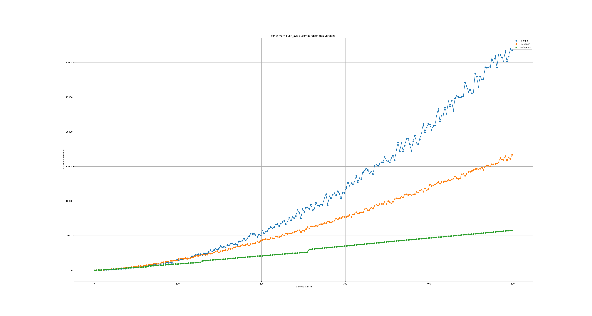
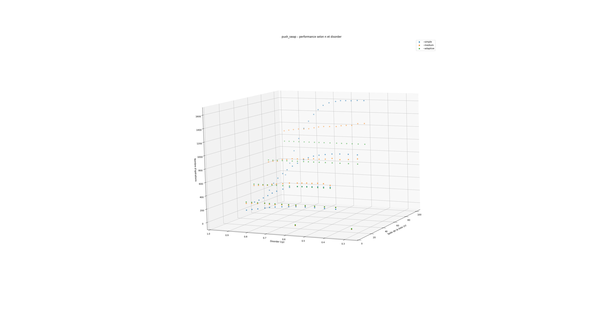

*This project has been created as partof the 42 curriculum by mthetcha,mboutte.*

# Description

The Push Swap project is a set of **algorithms** for sorting different lists of numbers of varying sizes and complexity. It is based on sorting between **stacks A and B** and a list of instructions for moving the list. The aim of this project is to work on **optimization**, discover **different sorting methods**, and **adapt** the sorting methods to make them work in two stacks.


# Instructions

Use `make` to compile all the files and get the push_swap file.

`./push_swap` : **Main function** that returns the list of instructions used to sort the list.

### Flags :

- `--simple` : Selection Sort *(by mthetcha)*
- `--medium` : Bucket Sort *(by mthetcha)*
- `--complex` : Radix Sort *(by mboutte)*
- `--adaptive` : Evaluate the complexity of the list and use on of the sorts (Default Flag) *(by mboutte)*
- `--bench` : Display informations about the sorting process *(by mboutte)*


# Resources

- **Online documentations** : General research and algorithm understanding
- **Peer-to-peer learning** : Code reviews and discussions
- **Visualgo** : Visualize sorting algorithms
  https://visualgo.net/en/sorting
- **Stack** : Understanding stack data structures
  https://en.wikipedia.org/wiki/Stack_(abstract_data_type)
- **Sort Visualizer** : Get idea of sorting behavior
  https://sortvisualizer.com/
- **README Markdown** :
  https://docs.github.com/fr/get-started/writing-on-github/getting-started-with-writing-and-formatting-on-github/basic-writing-and-formatting-syntax


# Technical explanation

### Selection Sort O(n²):

This sorting has a complexity of **O(n²)**. It works by repeating **three steps**: finding the maximum value in stack A, moving it to the top, and finally pushing it. These steps are repeated until stack A is empty. Finally, B is unstacked on A to arrange the values in ascending order.

### Bucket Sort O(n√n):

This sorting has a complexity of **O(n√n)**. It works by separating the list into **√n buckets** in stack B by removing the values included in each range from stack A. Each bucket is a range of values.
```
[12, 8, 6, 4, 1, 10, 3, 9, 5, 7, 2, 11] 	Stack A
[] 											Stack B

[1,3,2,4]		First Bucket (Values between 1 and 4)
[8,6,5,7]		Second Bucket (Values between 5 and 8)
[12,10,9,11]	Last Bucket (Values between 9 and 12)

[] 											Stack A
[1, 3, 2, 4, 8, 6, 5, 7, 12, 10, 9, 11] 	Stack B
 ```

Finally, the algorithm will unstack stack B to A, from the largest values to the smallest, processing by bucket, from the largest to the smallest.

### Radix Sort O(n log(n)):

This sorting has a complexity of **O(n*m)** where **m is numbers of bit of the biggest numbers**. It works by sorting numbers **bit by bit**, starting from the least significant bit to the most significant bit.

```
Numbers : [3, 2, 1, 0]		| Binary = [11, 10, 01, 00]

First passage: Sorting on the first bit
stack A = [2, 0] 			| Binary = [10, 00]
stack B = [3, 1]			| Binary = [11, 01]
End of step = [2, 0, 3, 1]	| Binary = [10, 00, 11, 01]

Second passage: Sorting on the second bit
stack A = [0, 1]			| Binary = [00, 01]
stack B = [2, 3]			| Binary = [10, 11]
End of step = [0, 1, 2, 3]	| Binary = [00, 01, 10, 11]

Arrey = [0, 1, 2, 3]
```

###  Adaptive Flag :

**In some cases, using the algorithm with the best algorithmic complexity isn't the best choice**. For example, with small arrays, selection sort is faster than radix sort because the time to loop through the array is negligible compared to the time to push multiple times the array between two stacks.
The goal isn't to count the number of operations of each algorithm and choose the best because that means executing all algorithms in each case including the shortest.
In our program, we use formulas based on graphs to choose the best algorithm based on multiple factors.

<p style="text-align:center;">
  
  
</p>